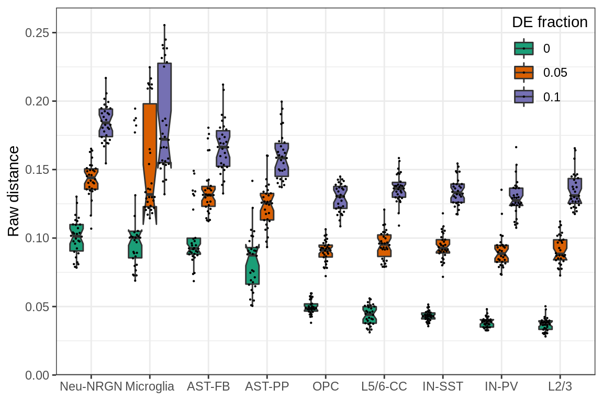
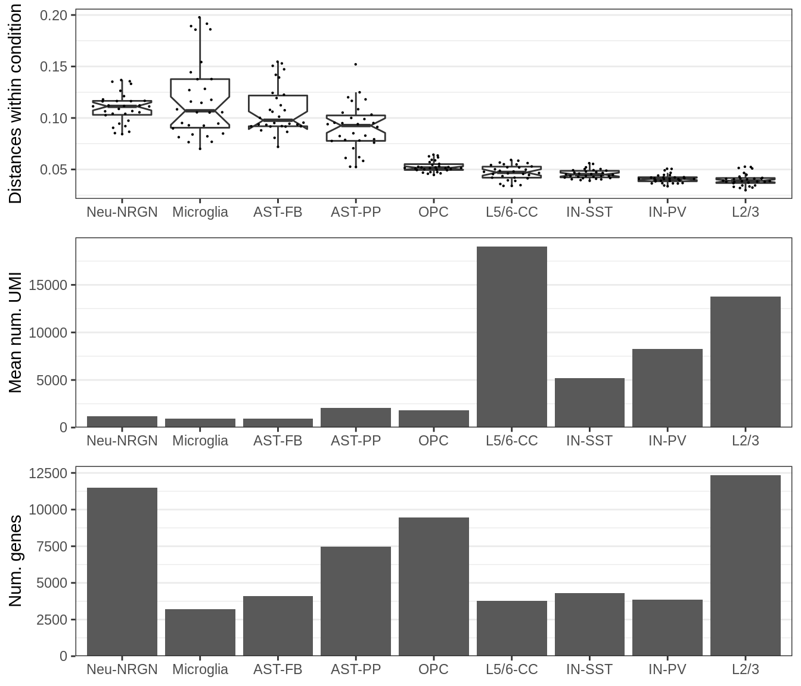
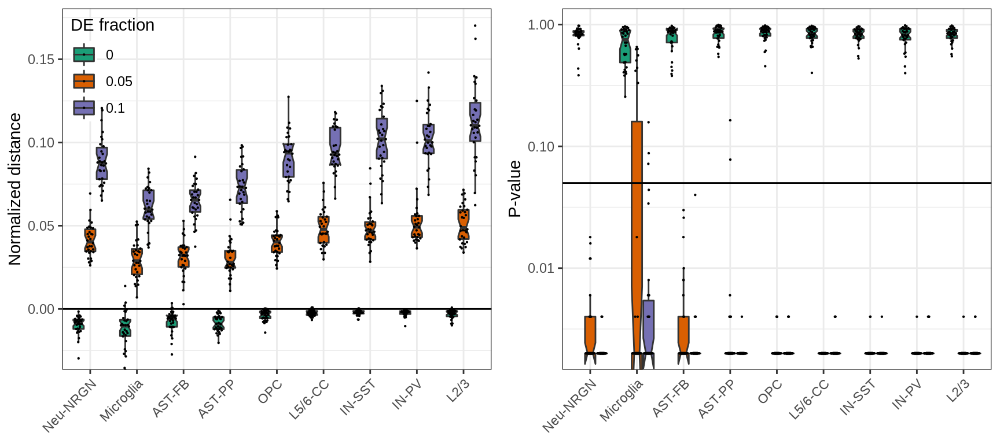
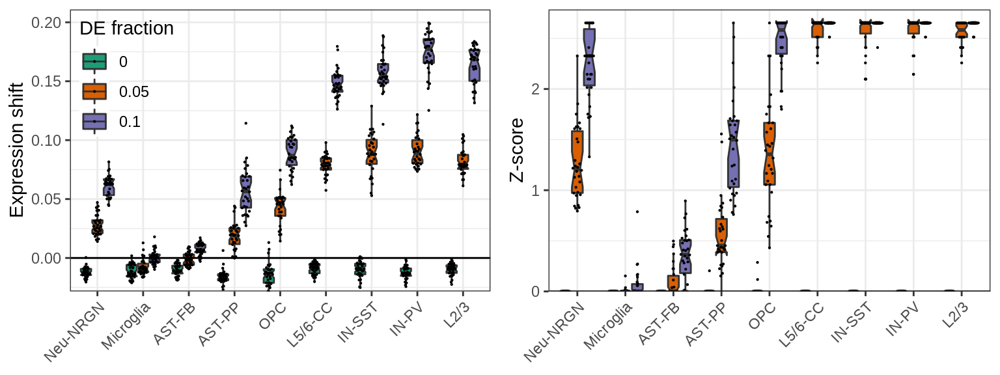
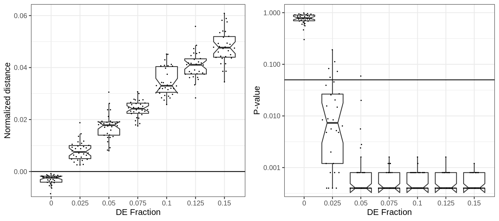
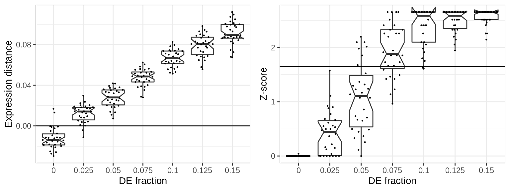

## Dependency on the number of cells and samples

### Number of samples per cell type

The raw expression distance does not depend on the number of samples:

The normalized distance does not depend either, however the statisticsl power of the test depends a lot:

Estimating expression shifts over top DE introduce slight dependency though. Probably, because of the quality of the selected DE genes.

Cluster-free estimates are similar to cluster-based in this regard:

And the number of significant DE genes depends on the number of samples, just like the significance tests for expression shifts above:

### Number of cells per cell type

The raw expression distances depend on the number of samples:

However the normalization fixes it:

And here, using top-DE genes does not introduce new dependencies:

The same with cluster-free:

While the number of significant DE genes does depend on the number of cells:

## Simulations for different cell types

### Dependency on the number of genes and other cell type covariates

Muscat doesn’t allow varying number of genes per cell type properly, so we simulated data from different cell types and visualized dependencies of the resulting distances on the parameters of these cell types. It does not allow to analyze possible sources of variation independently, but still provides some understanding of the dependencies.

The plot shows raw expression distances between conditions (y-axis) simulated from different cell types (x-axis) and different fraction of DE genes (color). Each dot on the plot is median distance between the two conditions for one simulation.

It can be seen that there is a lot of variation for the same DE fraction, even if it is set to 0.0. To explain the variation we may plot different cell type specific covariates.

This plot shows the number of expressed genes in real data (bottom), mean number of molecules per gene in real data (middle) and median distance between samples within the same condition for DE fraction set to 0.00 (top).

First, it can be seen that the distances within the same cell type are generally higher for cell types with low coverage. Second, variation between samples within the condition appear to be the main driver of the distances between the conditions.

Normalizing distances as we do to estimate expression shifts we can greatly reduce those biases:

And here, focusing on top genes reduces biases even more:

Cluster-free estimates are the most sensitive to variation in the data. They still work to prioritize cell types with adequate variation, but are likely to miss variable cell types:

Finally, below is the same plot for the number of significant DE genes. By design of the simulations, the number of DE genes linearly depends on the total number of genes. So, the right plot shows the fraction of DE genes, which also depends (slightly) on the variation within each cell types. It is up to debate, which of these measures should be used for real world examples, though.

## Sensitivity to LFC

Muscat does not allow simulating data with LFC < 1, so we analyse only values above 1. DE fraction is fixed to 0.05.

Increasing log2-fold change affects the distance a lot:

Estimating expression shifts over top DE introduce slight dependency though. Probably, because of the quality of the selected DE genes.

Cluster-free estimates have lower sensitivity, but still reach significance pretty fast:

The number of DE genes also gets more sensitive as the LFC increases:

  
## Sensitivity to DE fraction

After certain amount of changes, this distance reaches plateau, because adding more DE genes does not contribute to the amount of changes in top. One can also see that the sensitivity for small DE fraction improved greatly.

Cluster-free shifts are much less sensitive and more variable than the cluster-based version:

There is no surprises regarding the number of DE genes as a metric here:

## Simulation of pairwise distances

In these simulations we artificially generate pairwise distance matrix by sampling from two normal distributions with controlled distance between their means and controlled variance of each distribution. Then, we compare three types of distance estimates:

1.  **Shift**: \\(\\textbf{d}\_{between} - 0.5 \\cdot \\left( \\mathrm{MED}(\\textbf{d}\_{case}) + \\mathrm{MED}(\\textbf{d}\_{control}) \\right)\\)
2.  **Total**: \\(\\textbf{d}\_{between} - \\mathrm{MED}(\\textbf{d}\_{control})\\)
3.  **Variance**: \\(\\textbf{d}\_{case} - \\mathrm{MED}(\\textbf{d}\_{control})\\)

### Equal variance, varying mean

First, let us change mean between two conditions, keeping the variance constant.

The plot shows change in expression distances (y-axis) of different types (color) for increasing mean offset between case and control (x-axis) and fixed standard deviation (std=1.0 for the top plot and std=2.0 for the bottom plot). It can be seen that the "Variance" distance does depend on mean offset, while "Shift" and "Total" go up linearly. It is also important to note that when variance within condition increase (bottom plot), the sensitivity of all distances goes down. So, if two cell types have the same mean shift, but different variance, the cell type with lower variance would have higher normalized distance.

### Equal mean, varying variance

Now, we will fix the mean offset to different values and vary variance within Case samples, keeping Control variance fixed (`std=1.0`).

This panel shows change in expression distances (y-axis) of different types (color) for increasing standard deviation in Case (x-axis) and fixed Mean offset (from 0 to 2 in the three plots top-down). It can be seen that the "Shift" distance is quite insensitive to the changes in variance, while "Variance" distance behaving exactly the same for each offset value. It also shows that "Total" distance captures both changes.

  
